# DAI - Laboratoire HTTP
# Étape 1
## Docker base image
* On utilise l'image officielle de php:7.2-apache.
``` dockerfile
FROM php:7.2-apache
COPY src /var/www/html/
```
* On copie les sources du ficher src dans la vm docker.
* J'ai choisi comme contenu de ma page html une page bootstrap [one page](https://bootstrapmade.com/herobiz-bootstrap-business-template/) gratuite.
* J'ai modiifé le contenu de cette page pour être plus correct dans le contexte du laboratoire.
## Build
* Se rendre dans le dossier contenant le dockerfile et les sources voulus pour notre serveur http static
* lancer cette ligne de commande:
```
docker build -t php-apache .
```
* voilà le résultat qui est attendu :


## Run
* Pour run l'image docker utiliser la commande suivante
```
docker run -p <port_souhaité>:80 php-apache
```
* Voici le résultat qui est attendu :


* Vous pouvez maintenant accéder au contenu via un browser à l'adresse ```localhost:<port souhaité>```


# Rapport labo HTTP Infra

## Etape 2

### Etape 2a
Création d'un répertoire qui va contenir l'image de notre application node.js, qu'on va appeler express-image par exemple, dans notre répertoire qui contient les images docker. Dans ce dossier, on va créer un Dockerfile :

``` dockerfile
FROM node:18.12
COPY src /opt/app
CMD ["node", "/opt/app/index.js"]
```

La version indiquée dans le `FROM` correspond à la derniere version stable de node, c'est-à-dire la version 18.12.1 au moment de la réalisation de ce labo. Node.js doit être installé avec la même version du Dockerfile.

Dans le même répertoire, il faut créer un dossier src et dans ce dossier, lancer la commande `npm init`. Les informations pour la création du package à donner sont les suivantes :

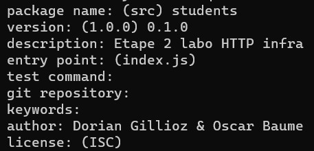

Cette commande a créé un fichier package.json qui contient les informations entrées plus haut. Pour l'application qu'on va créer dans cette étape, on va avoir besoin de la librairie Chance.js, qui permet de fournir plein de valeurs aléatoires, comme des noms ou des dates. Pour cela il faut exécuter la commande `npm install --save chance` dans notre répertoire. Le `--save` permet de sauver la dépendance. Cette commande a créé un dossier node_modules et a modifié le package.json en ajouant une dépendance à Chance.js. On va créer un fichier index.js qui sera notre application.
``` js
var Chance = require('chance');
var chance = new Chance();

console.log(chance.animal());
```
Cette application va afficher un animal aléatoire qui provient de chance. Pour tester notre application, on va lancer la commande `node index.js`, qui devrait afficher quelque chose comme ça :

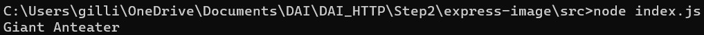

Pour créer notre image docker, il faut remonter d'un répertoire et exécuter la commande `docker build -t <préfixe>/<nom> .`. Une fois l'image créée, on peut run l'image grace à la commamnde `docker run <préfixe>/<nom>` qui devrait exécuter notre application js :

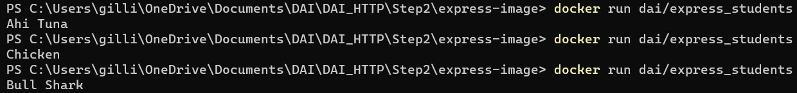

Pour explorer notre image, il faut exécuter la commande `docker run -it <préfixe>/<nom> /bin/bash` :

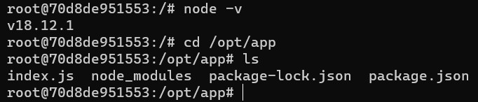

*Exemple d'exécution de commandes dans l'image.*

### Etape 2b
Installation de expressjs avec la commande `npm install express --save` et installation de Express application generator avec la commande `npm install express-generator -g`. Lors de l'installation de express-generator, il peut avoir des vulnérabilités dues à des versions dépreciées. Pour résoudre le problème, il faut exécuter la commande `npm audit fix --force`.
### TODO: expliquer express et generator

Voici un programme de test de expressjs que l'on peut mettre dans `index.js` :

``` js
var express = require('express');
var app = express();

app.get('/test', function(req, res) {
    res.send("Hello DAI test");
});

app.get('/', function(req, res) {
    res.send("Hello DAI");
});

app.listen(3000, function() {
    console.log("Accepting HTTP requests on port 3000.");
});
```

On peut le tester dans le terminal avec la commande `telnet localhost 3000`, ou sur Windows avec la commande `ncat localhost 3000 -C` :

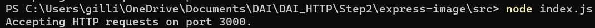

*Run de l'application index.js*

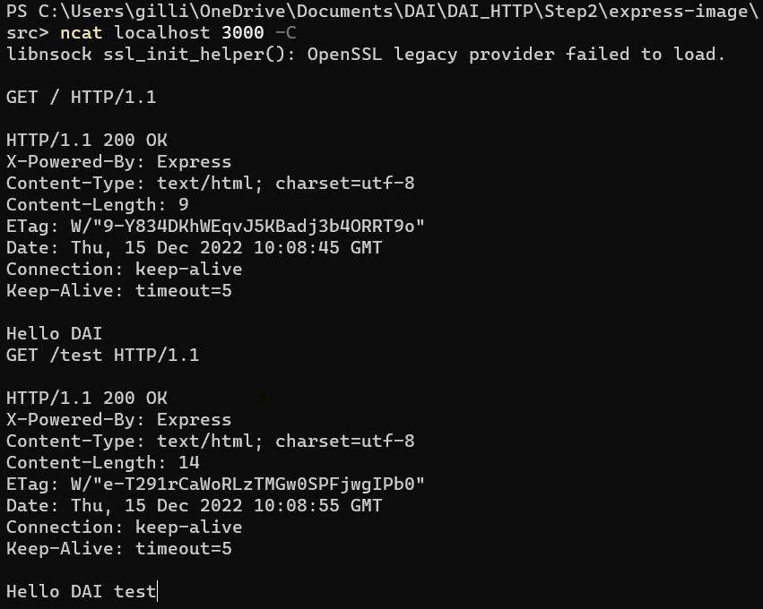

*Envoi de requêtes au serveur*

Une fois l'application lancée, on peut lui envoyer des requêtes depuis le port 3000. On peut lui envoyer une requête `GET` sur `/` et `/test`, comme défini dans `app.get()` qui va afficher respectivement `Hello DAI` et `Hello DAI test`.

On va maintenant créer notre programme qui va permettre d'afficher entre 1 et 10 animaux générés au hasard. Un animal est caractérisé par son type d'animal, son nom, qui est une chaine de caractère générée au hasard qui ressemble à un mot, son genre et son anniversaire.

``` js
var Chance = require('chance');
var chance = new Chance();

var express = require('express');
var app = express();

app.get('/', function(req, res) {
    res.send(generateAnimals());
});

app.listen(3000, function() {
    console.log("Accepting HTTP requests on port 3000.");
});

function generateAnimals() {
    var numberOfAnimals = chance.integer({
        min: 1,
        max: 10
    });
    console.log(numberOfAnimals + " animals :");
    var animals = [];
    for (var i = 0; i < numberOfAnimals; i++) {
        var birthYear = chance.year({
            min: 1998,
            max: 2021
        });
        animals.push({
            animal: chance.animal(),
            name: chance.word(),
            gender: chance.gender(),
            birthday: chance.birthday({
                year: birthYear
            })
        });
    }
    console.log(animals);
    return animals;
}
```
La fonction `generateAnimals()` va générer notre liste d'animaux au hasard.

Pour tester notre programme on va exécuter notre application avec `node index.js` et envoyer des requêtes `GET` sur `/` à l'aide de la commande `telnet localhost 3000` ou `ncat localhost 3000 -C` pour Windows. On peut aussi tester en ouvrant dans le navigateur `localhost:3000`. La requête `GET`va retourner la liste des animaux du `return` de la fonction et le serveur va afficher les `console.log()` de la fonction.

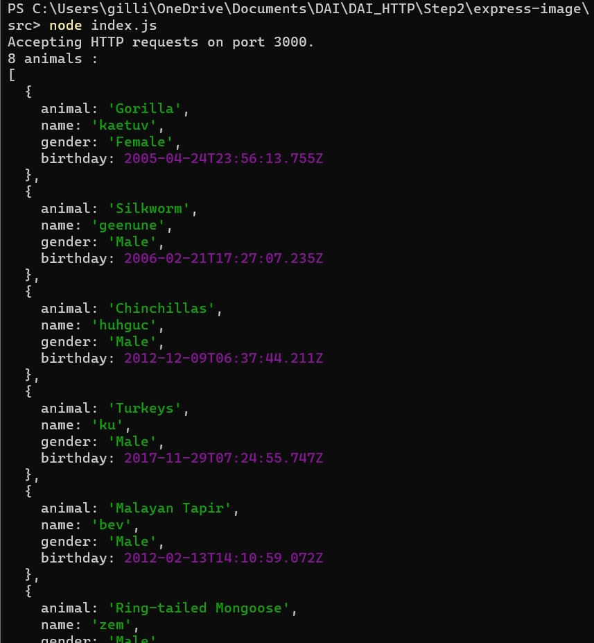

*Affichage de la liste des animaux.*

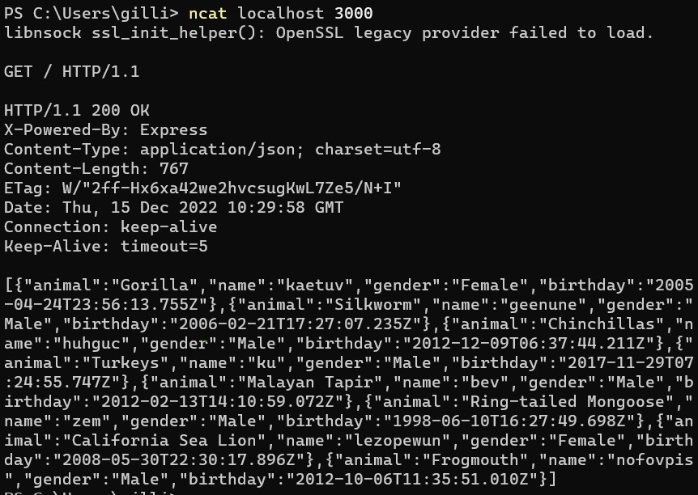

*La liste des animaux générée.*

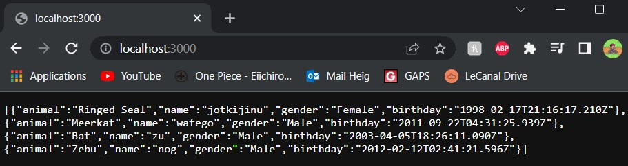

*Affichage de la requête dans le navigateur.*

Actuellement, notre container n'est pas joignable depuis l'extérieur comme on n'a pas fait de port mapping. On peut exécuter le container `busybox`, qu'il faudra avoir installé, avec la commande `docker run -a stdin -a stdout -i -t busybox`.

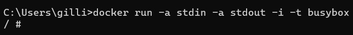

On peut récupérer l'IP du container grâce à la commande `docker inspect <nom container>`.

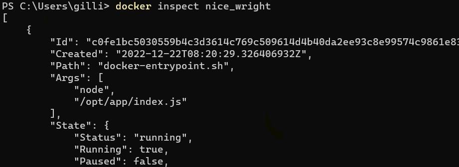

*...*

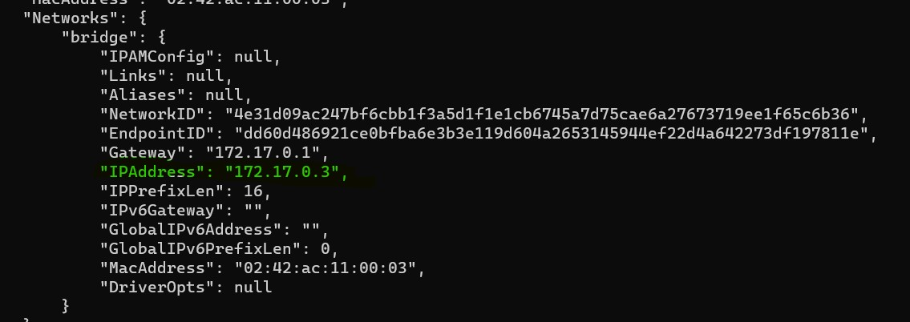

On peut faire un `telnet` sur l'adresse récupérée et faire des requêtes sur notre application.

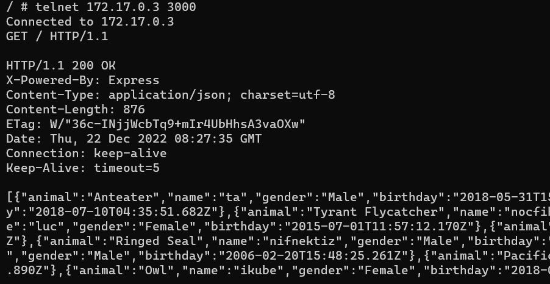

Pour accéder depuis l'extérieur, on peut déjà tuer notre container avec la commande `docker kill <nom container>`. On peut exécuter notre container avec la commande `docker run -p 9090:3000 <préfixe>/<nom>`. On peut accéder depuis l'extérieur en faisant un `telnet <adresse machine physique> 9090`.

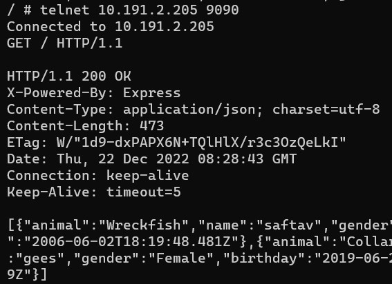

On peut aussi tester dans le navigateur.

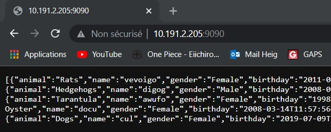

# Étape 3
## Docker compose to build the infrastructure
* j'ai repris les 2 dockerfile de la patie 1 et 2, avec le code pour le site static et dynamique. J'ai du les modifier pour qu'on puisse communiquer avec le reverse proxy.
* J'ai du ajouter la commande EXPOSE dans les Dockerfile des 2 services. J'ai exposé les ports 80 (static) et 3000 (dynamic)
### docker-compose
``` dockerfile
services:
  reverse-proxy:
    # The official v2 Traefik docker image
    image: traefik:v2.9
    # Enables the web UI and tells Traefik to listen to docker
    command: --api.insecure=true --providers.docker  --entryPoints.web.address=:80 --entryPoints.admin.address=:3000
    ports:
      # The HTTP port
      - "80:80"
      # The Web UI (enabled by --api.insecure=true)
      - "8080:8080"
    volumes:
      # So that Traefik can listen to the Docker events
      - /var/run/docker.sock:/var/run/docker.sock
  static:
    build: ./php-apache
    scale: 3
    labels:
      - "traefik.http.routers.static.rule=Host(`localhost`)"
      - "traefik.http.routers.static.entrypoints=web"
  dynamic:
    build: ./express-image
    scale: 3
    labels:
      - "traefik.http.routers.dynamic.rule=Host(`localhost`)"
      - "traefik.http.routers.dynamic.middlewares=dynamic-stripprefix"
      - "traefik.http.middlewares.dynamic-stripprefix.stripprefix.prefixes=/api"
      - "traefik.http.routers.dynamic.rule=Host(`localhost`) && Path(`/api`)"
```
* j'ai placer les éléments de l'étape 1 dans le dossier php-apache et ceux de l'étape 2 dans le dossier express-image.
* Les 2 services auront 3 instances je l'indique par la commande ``scale: 3``
* Les container static seront accédé via ``http://localhost`` j'indique cela dans les labels du service
* Les container dynamic seront accédé via ``http://localhost/api``
# Étape 4
## AJAX requests with JQuery
* Pour cette partie il m'a suffit de modifier le contenu du container static
* J'ai ajouter jquery avec la balise suivante :
```html
<script type="text/javascript" 
src="http://ajax.googleapis.com/ajax/libs/jquery/3.5.1/jquery.min.js">
</script>
```
* J'ai ensuite créer un ficher javascript pour faire le load des informations. Le fichier s'appelle animals.js
* Je l'ai ajouté à index.html avec cette balise :
```html
<script src="assets/js/animals.js"></script>
```
* Le ficher animals.js contient ceci :
```javascript
$(function () {
    //fonction qui va 'load' un nouveau tableau d'animaux depuis localhost/api
    function loadAnimals(){
        $.getJSON("/api",function(animals){
            // animals = json récupéré depuis /api
            console.log(animals);
            var msg = "Nobobdy is here...";
            // lorsque le tableau est rempli 
            if(animals.length > 0){
                // on annonce qu'elle animal est arrivé via la variable msg
                msg = animals[0].name + " the " + animals[0].animal + " is here!";
            }
            // le contenu de dom ayant pour id animal est changé pour être msg
            $("#animal").text(msg);
        });
    }
    // on appelle une première fois la fonction 
    loadAnimals();
    // on indique que toute les 2 secondes on aimerait que la fonction loadAnimals soit appellée
    setInterval(loadAnimals,2000);
});
```
* J'ai ajouté l'id animal à un élément de index.html pour que le message s'affiche.
* Voilà le résultat final :
  
# Étape 5
## Sticky session
* Pour cette étape il n'y pas beaucoup de chose à modifier.
* Il suffit d'ajouter ces 2 lignes au label du service static dans le docker-compose.yml :
```dockerfile
- "traefik.http.services.static-service.loadBalancer.sticky.cookie=true"
- "traefik.http.services.static-service.loadBalancer.sticky.cookie.name==static_server_cookie"
```
# Étape 6
## Management UI
* Après quelque recherche sur internet et des discussions avec certains camarades de classe, j'ai décidé d'utiliser Portainer pour cette dernière partie du laboratoire.
* Il m'a donc suffit de rajouter un service au docker-compose.yml :
```dockerfile
  portainer:
    image: portainer/portainer-ce:latest
    container_name: portainer
    restart: unless-stopped
    security_opt:
      - no-new-privileges:true
    volumes:
      - /etc/localtime:/etc/localtime:ro
      - /var/run/docker.sock:/var/run/docker.sock:ro
      - ./portainer-data:/data
    labels:
      - "traefik.http.routers.portainer.rule=Host(`localhost`)"
      - "traefik.http.routers.portainer.entrypoints=admin"
      - "traefik.http.services.portainer.loadbalancer.server.port=9000"
```
* J'ai traduis la configuration de dockerfile qui est proposé dans la [documentation portainer](https://docs.portainer.io/start/install/server/docker/wcs) :
```dockerfile
docker run -d -p 8000:8000 -p 9443:9443 --name portainer --restart always -v \\.\pipe\docker_engine:\\.\pipe\docker_engine -v portainer_data:C:\data portainer/portainer-ce:latest
```
* Pour accéder à Portainer il faut se connecter à ``http://localhost:1717``
* le choix du port n'a pas une importance majeur pour le changer vous pouvez modifier cette commande : ``--entryPoints.admin.address=:PORT`` dans les command du reverse-proxy