# Rapport labo HTTP Infra

## Etape 2

### Etape 2a
Création d'un répertoire qui va contenir l'image de notre application node.js, qu'on va appeler express-image par exemple, dans notre répertoire qui contient les images docker. Dans ce dossier, on va créer un Dockerfile :

``` dockerfile
FROM node:18.12
COPY src /opt/app
CMD ["node", "/opt/app/index.js"]
```

La version indiquée dans le `FROM` correspond à la derniere version stable de node, c'est-à-dire la version 18.12.1 au moment de la réalisation de ce labo. Node.js doit être installé avec la même version du Dockerfile.

Dans le même répertoire, il faut créer un dossier src et dans ce dossier, lancer la commande `npm init`. Les informations pour la création du package à donner sont les suivantes :


Cette commande a créé un fichier package.json qui contient les informations entrées plus haut. Pour l'application qu'on va créer dans cette étape, on va avoir besoin de la librairie Chance.js, qui permet de fournir plein de valeurs aléatoires, comme des noms ou des dates. Pour cela il faut exécuter la commande `npm install --save chance` dans notre répertoire. Le `--save` permet de sauver la dépendance. Cette commande a créé un dossier node_modules et a modifié le package.json en ajouant une dépendance à Chance.js. On va créer un fichier index.js qui sera notre application.
``` js
var Chance = require('chance');
var chance = new Chance();

console.log(chance.animal());
```
Cette application va afficher un animal aléatoire qui provient de chance. Pour tester notre application, on va lancer la commande `node index.js`, qui devrait afficher quelque chose comme ça :


Pour créer notre image docker, il faut remonter d'un répertoire et exécuter la commande `docker build -t <préfixe>/<nom> .`. Une fois l'image créée, on peut run l'image grace à la commamnde `docker run <préfixe>/<nom>` qui devrait exécuter notre application js :


Pour explorer notre image, il faut exécuter la commande `docker run -it <préfixe>/<nom> /bin/bash` :


*Exemple d'exécution de commandes dans l'image.*

### Etape 2b
Installation de expressjs avec la commande `npm install express --save` et installation de Express application generator avec la commande `npm install express-generator -g`. Lors de l'installation de express-generator, il peut avoir des vulnérabilités dues à des versions dépreciées. Pour résoudre le problème, il faut exécuter la commande `npm audit fix --force`.
### TODO: expliquer express et generator

Voici un programme de test de expressjs que l'on peut mettre dans `index.js` :

``` js
var express = require('express');
var app = express();

app.get('/test', function(req, res) {
    res.send("Hello DAI test");
});

app.get('/', function(req, res) {
    res.send("Hello DAI");
});

app.listen(3000, function() {
    console.log("Accepting HTTP requests on port 3000.");
});
```

On peut le tester dans le terminal avec la commande `telnet localhost 3000`, ou sur Windows avec la commande `ncat localhost 3000 -C` :

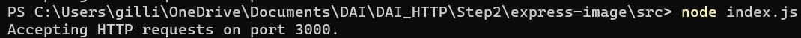

*Run de l'application index.js*

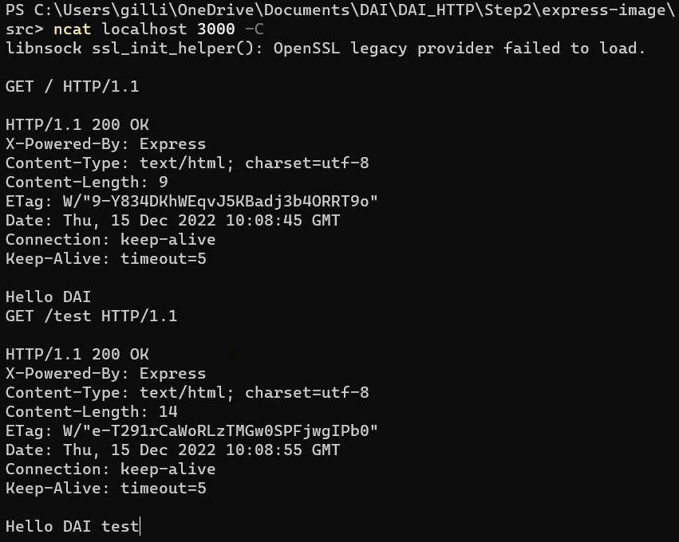

*Envoi de requêtes au serveur*

Une fois l'application lancée, on peut lui envoyer des requêtes depuis le port 3000. On peut lui envoyer une requête `GET` sur `/` et `/test`, comme défini dans `app.get()` qui va afficher respectivement `Hello DAI` et `Hello DAI test`.

On va maintenant créer notre programme qui va permettre d'afficher entre 1 et 10 animaux générés au hasard. Un animal est caractérisé par son type d'animal, son nom, qui est une chaine de caractère générée au hasard qui ressemble à un mot, son genre et son anniversaire.

``` js
var Chance = require('chance');
var chance = new Chance();

var express = require('express');
var app = express();

app.get('/', function(req, res) {
    res.send(generateAnimals());
});

app.listen(3000, function() {
    console.log("Accepting HTTP requests on port 3000.");
});

function generateAnimals() {
    var numberOfAnimals = chance.integer({
        min: 1,
        max: 10
    });
    console.log(numberOfAnimals + " animals :");
    var animals = [];
    for (var i = 0; i < numberOfAnimals; i++) {
        var birthYear = chance.year({
            min: 1998,
            max: 2021
        });
        animals.push({
            animal: chance.animal(),
            name: chance.word(),
            gender: chance.gender(),
            birthday: chance.birthday({
                year: birthYear
            })
        });
    }
    console.log(animals);
    return animals;
}
```
La fonction `generateAnimals()` va générer notre liste d'animaux au hasard.

Pour tester notre programme on va exécuter notre application avec `node index.js` et envoyer des requêtes `GET` sur `/` à l'aide de la commande `telnet localhost 3000` ou `ncat localhost 3000 -C` pour Windows. On peut aussi tester en ouvrant dans le navigateur `localhost:3000`. La requête `GET`va retourner la liste des animaux du `return` de la fonction et le serveur va afficher les `console.log()` de la fonction.
 
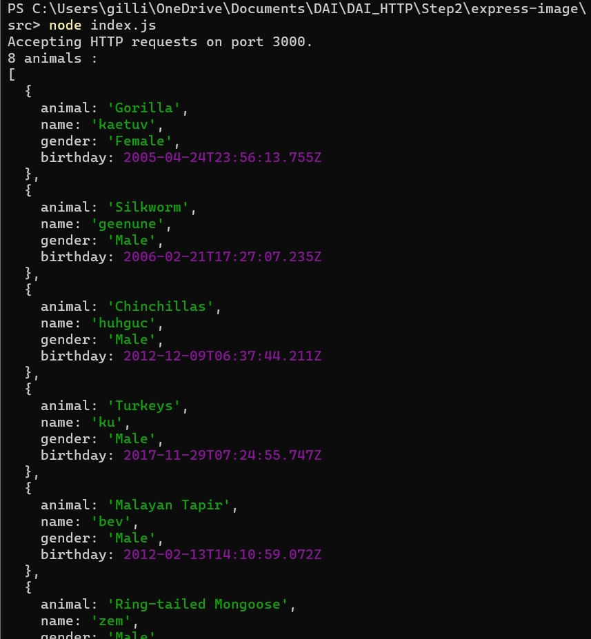

*Affichage de la liste des animaux.*

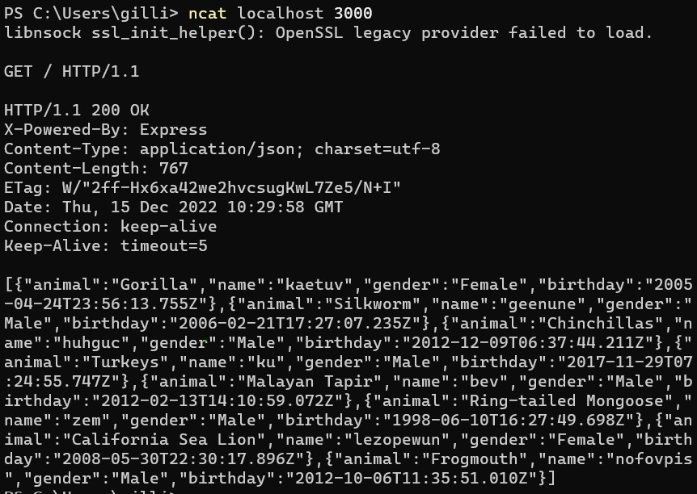

*La liste des animaux générée.*

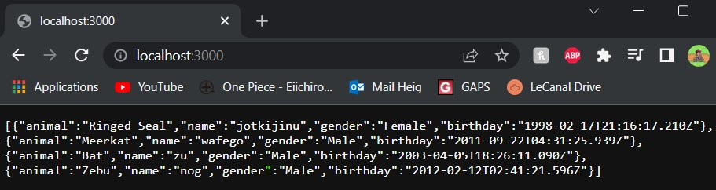

*Affichage de la requête dans le navigateur.*

Actuellement, notre container n'est pas joignable depuis l'extérieur comme on n'a pas fait de port mapping. On peut exécuter le container `busybox`, qu'il faudra avoir installé, avec la commande `docker run -a stdin -a stdout -i -t busybox`. 

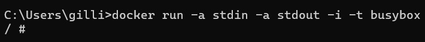

On peut récupérer l'IP du container grâce à la commande `docker inspect <nom container>`. 

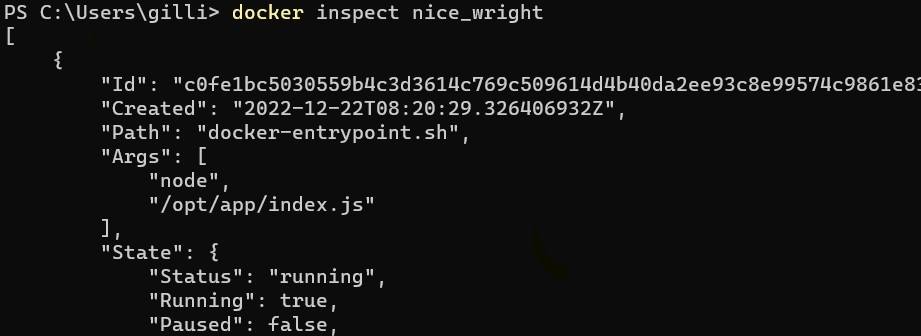

*...*

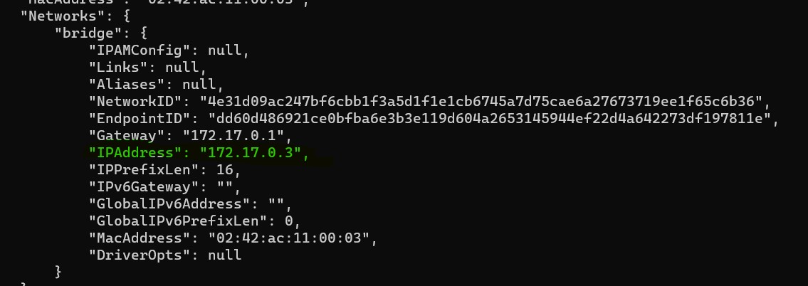

On peut faire un `telnet` sur l'adresse récupérée et faire des requêtes sur notre application. 

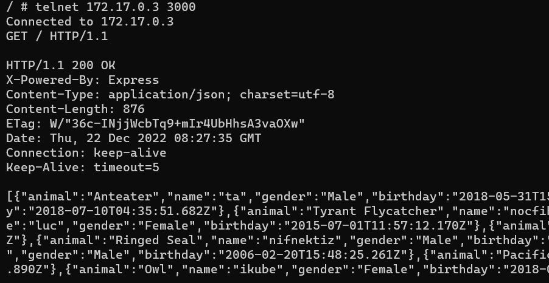

Pour accéder depuis l'extérieur, on peut déjà tuer notre container avec la commande `docker kill <nom container>`. On peut exécuter notre container avec la commande `docker run -p 9090:3000 <préfixe>/<nom>`. On peut accéder depuis l'extérieur en faisant un `telnet <adresse machine physique> 9090`. 

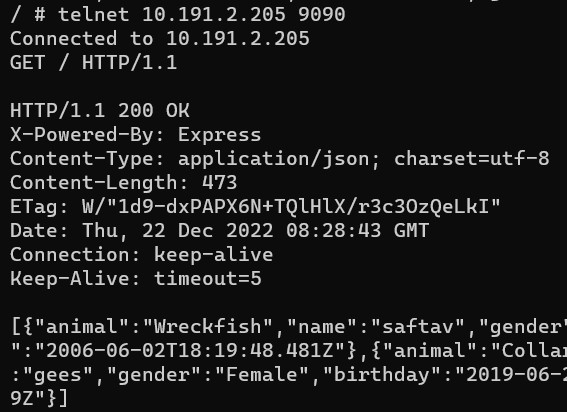

On peut aussi tester dans le navigateur.

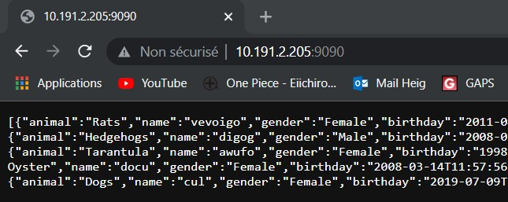