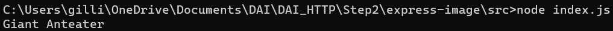

# Rapport labo HTTP Infra

## Etape 2

### Etape 2a
Création d'un répertoire qui va contenir l'image de notre application node.js, qu'on va appeler express-image par exemple, dans notre répertoire qui contient les images docker. Dans ce dossier, on va créer un Dockerfile :

``` docker
FROM node:18.12
COPY src /opt/app
CMD ["node", "/opt/app/index.js"]
```

La version indiquée dans le `FROM` correspond à la derniere version stable de node, c'est-à-dire la version 18.12.1 au moment de la réalisation de ce labo. Node.js doit être installé avec la même version du Dockerfile.

Dans le même répertoire, il faut créer un dossier src et dans ce dossier, lancer la commande `npm init`. Les informations pour la création du package à donner sont les suivantes :


Cette commande a créé un fichier package.json qui contient les informations entrées plus haut. Pour l'application qu'on va créer dans cette étape, on va avoir besoin de la librairie Chance.js, qui permet de fournir plein de valeurs aléatoires, comme des noms ou des dates. Pour cela il faut exécuter la commande `npm install --save chance` dans notre répertoire. Le `--save` permet de sauver la dépendance. Cette commande a créé un dossier node_modules et a modifié le package.json en ajouant une dépendance à Chance.js. On va créer un fichier index.js qui sera notre application.
``` js
var Chance = require('chance');
var chance = new Chance();

console.log("Bonjour " + chance.name());
```
Cette application va afficher Bonjour avec un nom aléatoire qui provient de chance. Pour tester notre application, on va lancer la commande `node index.js`, qui devrait afficher quelque chose comme ça :



Pour créer notre image docker, il faut remonter d'un répertoire et exécuter la commande `docker build -t <préfixe>/<nom> .`. Une fois l'image créée, on peut run l'image grace à la commamnde `docker run <préfixe>/<nom>` qui devrait exécuter notre application js :


Pour explorer notre image, il faut exécuter la commande `docker run -it <préfixe>/<nom> /bin/bash` :


Exemple d'exécution de commandes.